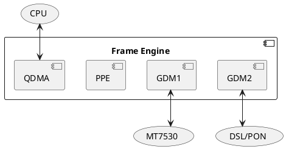

## Frame Engine

Frame engine port numbers are listed [here](https://github.com/cjdelisle/EN751221-Linux26/blob/master/tclinux_phoenix/modules/private/fe/en7512/fe_reg_en7512.h#L696).

### FE_BASE

[0xBFB50000](https://github.com/cjdelisle/EN751221-Linux26/blob/master/tclinux_phoenix/modules/private/ether/en7512/eth_en7512.h#L53)

### Related Specifications
The register map does not match the MT7621 SoC but they are related.
[Chapter 2.3, Page 269](https://www.scribd.com/document/741583707/MT7621-ProgrammingGuide-DMAs-V1-1)