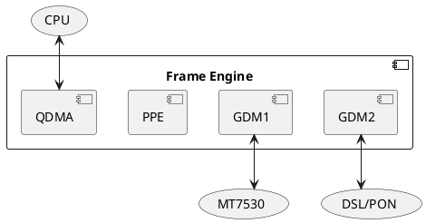

# Frame Engine

Frame engine port numbers are listed [here](https://github.com/cjdelisle/EN751221-Linux26/blob/master/tclinux_phoenix/modules/private/fe/en7512/fe_reg_en7512.h#L696).




## FE_BASE

[0xBFB50000](https://github.com/cjdelisle/EN751221-Linux26/blob/master/tclinux_phoenix/modules/private/ether/en7512/eth_en7512.h#L53)

## QDMA

The EcoNet ethernet device uses a subsystem called QDMA (QoS + DMA?) for handling transfers
between the system and the ethernet ports. On EN751221 there are two QDMA devices, generally
they are used one for LAN and one for the WAN, though they both have the ability to send to
either port.

On a fiber modem, the WAN port goes to the fiber subsystem, while on a DSL modem, it goes
to an auxilliary ethernet port.

The LAN port goes to an integrated switch which routes to the four physical LAN ports.

### DMA Zones
Each QDMA system has a pair of RX/TX queues, though drivers generally only use queue zero.

### DMA DSCP Message

```
.   0               1               2               3
    0 1 2 3 4 5 6 7 0 1 2 3 4 5 6 7 0 1 2 3 4 5 6 7 0 1 2 3 4 5 6 7
   +-+-+-+-+-+-+-+-+-+-+-+-+-+-+-+-+-+-+-+-+-+-+-+-+-+-+-+-+-+-+-+-+
 0 |                           Reserved                            |
   +-+-+-+-+-+-+-+-+-+-+-+-+-+-+-+-+-+-+-+-+-+-+-+-+-+-+-+-+-+-+-+-+
 4 |D|R|N|         Reserved        |          pkt_len(16)          |
   +-+-+-+-+-+-+-+-+-+-+-+-+-+-+-+-+-+-+-+-+-+-+-+-+-+-+-+-+-+-+-+-+
 8 |                        pkt_addr (32)                          |
   +-+-+-+-+-+-+-+-+-+-+-+-+-+-+-+-+-+-+-+-+-+-+-+-+-+-+-+-+-+-+-+-+
12 |          Reserved           |          next_idx (12)          |
   +-+-+-+-+-+-+-+-+-+-+-+-+-+-+-+-+-+-+-+-+-+-+-+-+-+-+-+-+-+-+-+-+
16 |                                                               |
   +                                                               +
20 |                                                               |
   +                          msg (128)                            +
22 |                                                               |
   +                                                               +
24 |                                                               |
   +-+-+-+-+-+-+-+-+-+-+-+-+-+-+-+-+-+-+-+-+-+-+-+-+-+-+-+-+-+-+-+-+
32
```

* `D` - Descriptor Done flag
* `R` - Packet has been dropped
* `N` - NLS flag (not allowed on EN751221)
* `pkt_len` - Length of the packet in bytes
* `pkt_addr` - Physical (DMA) address of the packet
* `next_idx` - Index of the next descriptor in the ring
* `msg` - Data about the packet, one of
  - Ethernet RX Message
  - Ethernet TX Message
  - xPON RX Message
  - xPON TX Message

#### Ethernet RX Message
This is the content of the DSCP `msg` field when you receive a packet from the wire.

```
.   0               1               2               3
    0 1 2 3 4 5 6 7 0 1 2 3 4 5 6 7 0 1 2 3 4 5 6 7 0 1 2 3 4 5 6 7
   +-+-+-+-+-+-+-+-+-+-+-+-+-+-+-+-+-+-+-+-+-+-+-+-+-+-+-+-+-+-+-+-+
 0 |                 Unknown                 |    channel    | unk |
   +-+-+-+-+-+-+-+-+-+-+-+-+-+-+-+-+-+-+-+-+-+-+-+-+-+-+-+-+-+-+-+-+
 4 | rev |6|4|F|T|V|F| sport |   crsn  |         ppe_entry         |
   +-+-+-+-+-+-+-+-+-+-+-+-+-+-+-+-+-+-+-+-+-+-+-+-+-+-+-+-+-+-+-+-+
 8 |                          Reserved                           |U|
   +-+-+-+-+-+-+-+-+-+-+-+-+-+-+-+-+-+-+-+-+-+-+-+-+-+-+-+-+-+-+-+-+
12 |                         vlan_header                           |
   +-+-+-+-+-+-+-+-+-+-+-+-+-+-+-+-+-+-+-+-+-+-+-+-+-+-+-+-+-+-+-+-+
16
```

* `channel` - In outgoing traffic, channel is selected to control QoS, in incoming traffic
it seems to still contain data such as the port which the traffic came from.
* `unk` - Unknown
* `rev` - Unknown ("Reseved"?)
* `6` - `ip6`, Is IPv6 Packet
* `4` - `ip4`, Is IPv4 Packet
* `F` - `ip4f`, probably a fragment of an IPv4 packet
* `T` - `tack`, probably a TCP ACK packet
* `V` - `l2vld`, probably means the Ethernet frame and any VLAN tags look valid
* `F` - `l4f`, probably means the layer 4 (TCP / UDP / ...) header could not be parsed because the packet is fragmented.
* `sport` - Where the packet came from, mostly unknown / unused, needs testing.
  - `0` - `SPORT_QDMA_LAN` / `SPORT_CPU`, Loopback ?
  - `1` - `SPORT_GDMA1`, LAN packet
  - `2` - `SPORT_GDMA2`, WAN packet
  - `3` - Unknown
  - `4` - `SPORT_PPE`, A message from the Packet Processing Engine ?
  - `5` - `SPORT_QDMA_WAN`, Loopback of packet destine for WAN ?
  - `6` - `SPORT_QDMA_HW`, Message from the QDMA hardware ?
  - `7` - `SPORT_DISCARD`, No idea what this is...
* `crsn` - Most likely a MediaTek PPE `CPU_REASON`, i.e. "why the packet is coming to you"
  - `00` - Unknown
  - `01` - Unknown
  - `02` - `MTK_PPE_CPU_REASON_TTL_EXCEEDED`
  - `03` - `MTK_PPE_CPU_REASON_OPTION_HEADER`
  - `04` - Unknown
  - `05` - Unknown
  - `06` - Unknown
  - `07` - `MTK_PPE_CPU_REASON_NO_FLOW`
  - `08` - `MTK_PPE_CPU_REASON_IPV4_FRAG`
  - `09` - `MTK_PPE_CPU_REASON_IPV4_DSLITE_FRAG`
  - `0a` - `MTK_PPE_CPU_REASON_IPV4_DSLITE_NO_TCP_UDP`
  - `0b` - `MTK_PPE_CPU_REASON_IPV6_6RD_NO_TCP_UDP`
  - `0c` - `MTK_PPE_CPU_REASON_TCP_FIN_SYN_RST`
  - `0d` - `MTK_PPE_CPU_REASON_UN_HIT`
  - `0e` - `MTK_PPE_CPU_REASON_HIT_UNBIND`
  - `0f` - `MTK_PPE_CPU_REASON_HIT_UNBIND_RATE_REACHED`
  - `10` - `MTK_PPE_CPU_REASON_HIT_BIND_TCP_FIN`
  - `11` - `MTK_PPE_CPU_REASON_HIT_TTL_1`
  - `12` - `MTK_PPE_CPU_REASON_HIT_BIND_VLAN_VIOLATION`
  - `13` - `MTK_PPE_CPU_REASON_KEEPALIVE_UC_OLD_HDR`
  - `14` - `MTK_PPE_CPU_REASON_KEEPALIVE_MC_NEW_HDR`
  - `15` - `MTK_PPE_CPU_REASON_KEEPALIVE_DUP_OLD_HDR`
  - `16` - `MTK_PPE_CPU_REASON_HIT_BIND_FORCE_CPU`
  - `17` - `MTK_PPE_CPU_REASON_TUNNEL_OPTION_HEADER`
  - `18` - `MTK_PPE_CPU_REASON_MULTICAST_TO_CPU`
  - `19` - `MTK_PPE_CPU_REASON_MULTICAST_TO_GMAC1_CPU`
  - `1a` - `MTK_PPE_CPU_REASON_HIT_PRE_BIND`
  - `1b` - `MTK_PPE_CPU_REASON_PACKET_SAMPLING`
  - `1c` - `MTK_PPE_CPU_REASON_EXCEED_MTU`
  - `1d` - `MTK_PPE_CPU_REASON_PPE_BYPASS`
  - `1e` - Unknown
  - `1f` - `MTK_PPE_CPU_REASON_INVALID`
* `ppe_entry` - Unsure but most likely the number of the Packet Processing Engine rule which was matched by the packet.
* `untag` - If `CDMA1_VLAN_CTRL` is set to `(TPID << 16) | 2` (TPID is a VLAN tag such as `0x8100`)
then the hardware will match and pop this VLAN tag off of incoming traffic. If that happens then the
untag bit will be set.
* `vlan_hdr` - If `untag` is set then this is the VLAN header which was popped. This *can* pop a
MediaTek "special" tags as well as the corresponding normal tags.

#### Ethernet TX Message
Construct this when you want to send an Ethernet frame

```
.   0               1               2               3
    0 1 2 3 4 5 6 7 0 1 2 3 4 5 6 7 0 1 2 3 4 5 6 7 0 1 2 3 4 5 6 7
   +-+-+-+-+-+-+-+-+-+-+-+-+-+-+-+-+-+-+-+-+-+-+-+-+-+-+-+-+-+-+-+-+
 0 |  rev  |           sp_tag              |O|     channel   | que |
   +-+-+-+-+-+-+-+-+-+-+-+-+-+-+-+-+-+-+-+-+-+-+-+-+-+-+-+-+-+-+-+-+
 4 |I|U|T|S|  udf_pmap | fpr |V| P |             vlanTag           |
   +-+-+-+-+-+-+-+-+-+-+-+-+-+-+-+-+-+-+-+-+-+-+-+-+-+-+-+-+-+-+-+-+
 8
```

* `rev`, Unused, probably short for "Reserved".
* `sp_tag`, MediaTek "Special Tag" format which encapsulates both switch port number and possible VLAN
* `O` - `oam`, Never used with Ethernet transmissions
* `channel` - The channel number for QoS prioritization
* `que` - `queue`, The queue number for QoS prioritization
* `I` - `ico`, Checksum offload, probably IP
* `U` - `uco`, Checksum offload, probably UDP
* `T` - `tco`, Checksum offload, probably TCP
* `S` - `sco`, Unknown, maybe SCTP checksum offload
* `udf_pmap` - Unknown / unused
* `fpr` - `fPort`, The destination
  - `0` - `TXMSG_FPORT_PDMA`, `DPORT_PDMA`, `DPORT_CPU`, loopback
  - `1` - `TXMSG_FPORT_GSW`, `DPORT_GDMA1`, LAN port (GB Switch)
  - `2` - `TXMSG_FPORT_GMAC`, `DPORT_GDMA2`, WAN port
  - `3` - Unknown
  - `4` - `TXMSG_FPORT_PPE`, `DPORT_PPE`, Packet Processing Engine, for hardware NAT
  - `5` - `TXMSG_FPORT_QDMA_CPU`, `DPORT_QDMA`, Unused, Loopback via QDMA
  - `6` - `DPORT_QDMA_HW`, Unused, Loopback via QDMA "hardware"
  - `7` - `DPORT_DISCARD`, Unused, Drop packet
* `V` - `vlanEn`, 1 if VLAN traffic, if set and `vlanTag` is zero then packet will be *untagged*
* `P` - `vlanTpID`
  - `0` - VLAN type `0x8100`
  - `1` - VLAN type `0x88a8`
  - `2` - Other / Unknown
* `vlanTag` - The VLAN number, if `vlanEn` is set

#### xPON RX Message
This is the content of the DSCP `msg` field when you receive a packet from the wire.

```
.   0               1               2               3
    0 1 2 3 4 5 6 7 0 1 2 3 4 5 6 7 0 1 2 3 4 5 6 7 0 1 2 3 4 5 6 7
   +-+-+-+-+-+-+-+-+-+-+-+-+-+-+-+-+-+-+-+-+-+-+-+-+-+-+-+-+-+-+-+-+
 0 |    Reserved   |          gem          |O|     channel   |L|R|C|
   +-+-+-+-+-+-+-+-+-+-+-+-+-+-+-+-+-+-+-+-+-+-+-+-+-+-+-+-+-+-+-+-+
 4 | res |6|4|F|T|V|F| sport |   crsn  |         ppe_entry         |
   +-+-+-+-+-+-+-+-+-+-+-+-+-+-+-+-+-+-+-+-+-+-+-+-+-+-+-+-+-+-+-+-+
 8 |        Reserved         |V| P |              vid              |
   +-+-+-+-+-+-+-+-+-+-+-+-+-+-+-+-+-+-+-+-+-+-+-+-+-+-+-+-+-+-+-+-+
12 |                          timestamp                            |
   +-+-+-+-+-+-+-+-+-+-+-+-+-+-+-+-+-+-+-+-+-+-+-+-+-+-+-+-+-+-+-+-+
16
```

* `gem` - "GPON Encapsulation Method" (GEM) port ID, issued by the OLT, GPON specific
* `O` - `oam`, flag indicating this is an OAM (Operations Administration and Maintenance) frame,
in EPON that means it's 802.3ah, in GPON it is OMCI.
* `channel` - On EPON this is the LLID, on GPON it seems to be the T-CONT. On EPON you can configure
this if sending an OAM packet by the first 2 bytes of the packet, on GPON it seems it only uses what
it receives.
* `L` - `longf` - Oversize frame (?)
* `R` - `runtf` - Runt frame (?)
* `C` - `crcer` - CRC Error
* `res` ... `ppe_entry` (2nd word) - Same as Ethernet
* `V` - `vlan` - Unused, perhaps optional VLAN tag popping like `U` (untag) from Ethernet frame
* `P` - `tpid` - Unused, probably VLAN type ID (`vlanTpID`) if a tag was untagged
* `vid` - Unused, probably VLAN number if VLAN was untagged
* `timestamp` - Unused, probably time packet received, unclear what is the granularity

#### xPON TX Message
This is what you need to construct in order to send off an xPON message.

```
.   0               1               2               3
    0 1 2 3 4 5 6 7 0 1 2 3 4 5 6 7 0 1 2 3 4 5 6 7 0 1 2 3 4 5 6 7
   +-+-+-+-+-+-+-+-+-+-+-+-+-+-+-+-+-+-+-+-+-+-+-+-+-+-+-+-+-+-+-+-+
 0 |r|  tsid   |T|D|          gem          |O|     channel   | que |
   +-+-+-+-+-+-+-+-+-+-+-+-+-+-+-+-+-+-+-+-+-+-+-+-+-+-+-+-+-+-+-+-+
 4 |I|U|T|S|    pmap   | fpr |V| P |               vid             |
   +-+-+-+-+-+-+-+-+-+-+-+-+-+-+-+-+-+-+-+-+-+-+-+-+-+-+-+-+-+-+-+-+
 8
```

* `r` - `resv`, Unused
* `tsid` - Perhaps "Traffic Stream ID", looks like a QoS in the xPON subsystem
* `T` - `tse`, "Traffic Streams Enabled" ? Set to 1 when `tsid` is set.
* `D` - `dei`, IEEE 802.1ad, Drop Eligibility Indicator.
* `gem` - The GEM port number
* `O` - `oam`, Set if this is an OMCI / OAM packet.
* Everything else: Seems to be same as with Ethernet


## Related Specifications
The register map does not match the MT7621 SoC but they are related.
[Chapter 2.3, Page 269](https://www.scribd.com/document/741583707/MT7621-ProgrammingGuide-DMAs-V1-1)