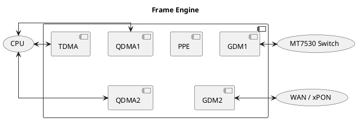
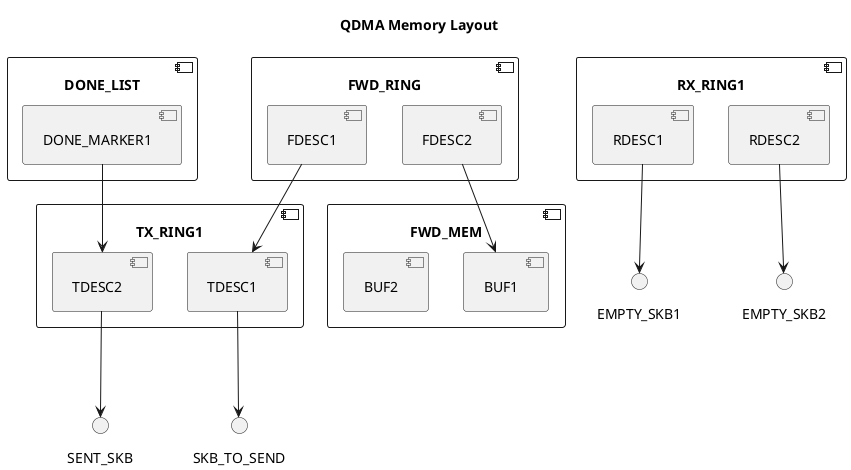

# Frame Engine

The EcoNet Ethernet / xPON driver is known as the "Frame Engine", it consists of:

* Two **QDMA** engines which handle QoS and which transport data to and from the CPU.
* One **TDMA** enigne (very similar to Mediatek PDMA) which can handle transport of data to and from the CPU.
* Two **GDM** ports which control the two physical ports, one of which goes to an internal MT7530 switch, and the other which goes to either an xPON subsystem, or a WAN ethernet port (in the DSL case).
* A Packet Processing Engine (**PPE**) which is able to do things like hardware NAT and QoS re-classification.

<div align="center">



</div>

It is tempting to think of the two QDMA engines as being linked to the two GDM ports, but this is not how the Frame Engine works. Each packet being sent it tagged with an `fport` (forward to port) which is one of the QDMA engines, one of the GDM engines, or the PPE.

## QDMA
The EcoNet ethernet device uses a subsystem called QDMA (QoS + DMA?) for handling transfers between the system (CPU) and the Frame Engine. The QDMAs are also used for QoS during hardware forwarding, so just because a packet enters a QDMA does not mean it is going to go to the CPU.


Each QDMA has:
* Two pairs of RX/TX descriptor rings: `RX_RING1` / `TX_RING1`, 2nd pair not shown.
* A single forwarding descriptor ring: `FWD_RING`
* A single TX-done-list `DONE_LIST`, and
* A single forwarding memory buffer `FWD_MEM`

### Workflows
* **Sending a packet**
  1. When you send a packet, you enqueue a pointer to the packet's data buffer in a descriptor in one of the two TX rings.
  2. The QDMA engine then creates a descriptor in the `FWD_RING` which references your descriptor in your TX ring
  3. The packet is sent
  4. The QDMA engine recycles the `FWD_RING` descriptor and sets the "done" mark on the descriptor in the TX ring
  5. The QDMA engine creates an entry in the `DONE_LIST` to indicate that you can now recycle the descriptor in the TX ring.
  6. When the `DONE_LIST` reaches a certain (configurable) proportion of done descriptors, you receive an interrupt so that you can recycle your descriptors. 
* **Receiving a packet**
  1. Before you can receive, you must register an empty packet buffer to a descriptor in the RX ring which you are to receive from.
  2. The QDMA engine selects a ready descriptor from the RX Ring and writes the data to the memory buffer that is pointed to by that descriptor.
  3. You receive an interrupt telling you that you have a packet ready to receive. Like with TX, you can configure the engine to delay interrupts so that receipts are aggregated, but unlike TX there is no done list because packets are always received in the order of the ring - so the ring is the list.
* **Forwarding a packet**
  1. During setup, you configure an area of memory to be available for packet forwarding (`FWD_MEM`).
  2. When a packet comes in which matches a forwarding rule, a descriptor is allocated in the `FWD_RING` and pointed to a memory location in the `FWD_MEM` zone.
  3. After the packet is sent, the `FWD_RING` entry and corrisponding buffer is recycled. All of these steps are done autonamously by the QDMA engine.

### How The TX/RX Rings Work
Each QDMA has two pairs of RX/TX rings. These rings are not relevant to the QoS process, but sending top priority traffic via the 2nd ring helps reduce latency because you don't need to wait for DMA to examine and prioritize the packets which are ahead of it.

In each ring there are `DSCP` messages ("Packet Descriptors"), each DSCP message has a pointer to the packet data, the length, and a `msg` field which contains contextual data depending on whether the packet is being sent or received and whether on Ethernet or xPON.

The `DSCP` messages also each have a field `next_idx` which points to "the next DSCP in the ring that should be examined". The way the rings are controlled is through two registers: `CPU_IDX` and `DMA_IDX`. On the TX side, the driver advances `CPU_IDX` to its current position in the ring and the DMA engine tries to catch up, updating `DMA_IDX` to it's position. In the TX direction, the driver is advancing `CPU_IDX` and the engine is trying to catch up with it, in the RX direction, the engine is advancing `DMA_IDX` and the driver is trying to catch up.

At initiation, the `next_idx` just points to the next element in the array, and for RX, it is enough that it stays this way because there's no reason to dequeue packets in any order other than the order that they are received. However, in the TX direction it is a different story. The order in which the QDMA engine dequeues packets is NOT the order that you enqueued them, it's an order based on priority - with highest priority and lowest priority (dropped packets) being dequeued before medium priority. Because the pool of ready TX DSCPs will become out of order, the `next_idx` field allows the driver to create a linked list starting from whichever packet the driver is currently processing to whichever packet you are just now enqueuing. When you enqueue a packet to transmit, you just need to have one spare DSCP that will be used to enqueue your *next* packet, and that's the index you will fill in to the `next_idx`. You can even enqueue multiple packets at the same time, as long as the first one is using your spare DSCP from your previous send, each one pointing to the next, and the `CPU_IDX` is set to the last one. The DMA engine will just walk the linked list from it's current `DMA_IDX` until it reaches your `CPU_IDX` and then stop.

Because TX packets are processed out of order, there is also a "Done List", referred to in the drivers as an "IRQ Queue". This is just an array of packet indexes that are completed.

### DMA DSCP Message
Every packet that is sent or received will be registered to a Packet Descriptor in the TX or RX ring, the layout of the descriptor is as follows:

```
.   0               1               2               3
    0 1 2 3 4 5 6 7 0 1 2 3 4 5 6 7 0 1 2 3 4 5 6 7 0 1 2 3 4 5 6 7
   +-+-+-+-+-+-+-+-+-+-+-+-+-+-+-+-+-+-+-+-+-+-+-+-+-+-+-+-+-+-+-+-+
 0 |                           Reserved                            |
   +-+-+-+-+-+-+-+-+-+-+-+-+-+-+-+-+-+-+-+-+-+-+-+-+-+-+-+-+-+-+-+-+
 4 |D|R|N|         Reserved        |          pkt_len(16)          |
   +-+-+-+-+-+-+-+-+-+-+-+-+-+-+-+-+-+-+-+-+-+-+-+-+-+-+-+-+-+-+-+-+
 8 |                        pkt_addr (32)                          |
   +-+-+-+-+-+-+-+-+-+-+-+-+-+-+-+-+-+-+-+-+-+-+-+-+-+-+-+-+-+-+-+-+
12 |          Reserved           |          next_idx (12)          |
   +-+-+-+-+-+-+-+-+-+-+-+-+-+-+-+-+-+-+-+-+-+-+-+-+-+-+-+-+-+-+-+-+
16 |                                                               |
   +                                                               +
20 |                                                               |
   +                          msg (128)                            +
22 |                                                               |
   +                                                               +
24 |                                                               |
   +-+-+-+-+-+-+-+-+-+-+-+-+-+-+-+-+-+-+-+-+-+-+-+-+-+-+-+-+-+-+-+-+
32
```

* `D` - Descriptor Done flag, this roughly means that the DSCP "belongs to the driver", the hardware will set it when it is done receiving or sending and will check to make sure it's not touching a DSCP that is not meant for it. This is not strictly necessary, you can determine which packets are yours only through ring indexes and the TX Done List, and setting and checking of this flag *can* be deactivated.
* `R` - Packet has been dropped
* `N` - NLS flag (not allowed on EN751221)
* `pkt_len` - Length of the packet in bytes
* `pkt_addr` - Physical (DMA) address of the packet
* `next_idx` - Index of the next descriptor in the ring.
* `msg` - Data about the packet, one of
  - Ethernet RX Message
  - Ethernet TX Message
  - xPON RX Message
  - xPON TX Message

#### Ethernet RX Message
This is the content of the DSCP `msg` field when you receive a packet from the wire.

```
.   0               1               2               3
    0 1 2 3 4 5 6 7 0 1 2 3 4 5 6 7 0 1 2 3 4 5 6 7 0 1 2 3 4 5 6 7
   +-+-+-+-+-+-+-+-+-+-+-+-+-+-+-+-+-+-+-+-+-+-+-+-+-+-+-+-+-+-+-+-+
 0 |                 Unknown                 |    channel    | unk |
   +-+-+-+-+-+-+-+-+-+-+-+-+-+-+-+-+-+-+-+-+-+-+-+-+-+-+-+-+-+-+-+-+
 4 | rev |6|4|F|T|V|F| sport |   crsn  |         ppe_entry         |
   +-+-+-+-+-+-+-+-+-+-+-+-+-+-+-+-+-+-+-+-+-+-+-+-+-+-+-+-+-+-+-+-+
 8 |                          Reserved                           |U|
   +-+-+-+-+-+-+-+-+-+-+-+-+-+-+-+-+-+-+-+-+-+-+-+-+-+-+-+-+-+-+-+-+
12 |                         vlan_header                           |
   +-+-+-+-+-+-+-+-+-+-+-+-+-+-+-+-+-+-+-+-+-+-+-+-+-+-+-+-+-+-+-+-+
16
```

* `channel` - In outgoing traffic, channel is selected to control QoS, in incoming traffic
it seems to still contain data such as the port which the traffic came from.
* `unk` - Unknown
* `rev` - Unknown ("Reseved"?)
* `6` - `ip6`, Is IPv6 Packet
* `4` - `ip4`, Is IPv4 Packet
* `F` - `ip4f`, probably a fragment of an IPv4 packet
* `T` - `tack`, probably a TCP ACK packet
* `V` - `l2vld`, probably means the Ethernet frame and any VLAN tags look valid
* `F` - `l4f`, probably means the layer 4 (TCP / UDP / ...) header could not be parsed because the packet is fragmented.
* `sport` - Where the packet came from, mostly unknown / unused, needs testing.
  - `0` - `SPORT_QDMA_LAN` / `SPORT_CPU`, Loopback ?
  - `1` - `SPORT_GDMA1`, LAN packet
  - `2` - `SPORT_GDMA2`, WAN packet
  - `3` - Unknown
  - `4` - `SPORT_PPE`, A message from the Packet Processing Engine ?
  - `5` - `SPORT_QDMA_WAN`, Loopback of packet destine for WAN ?
  - `6` - `SPORT_QDMA_HW`, Message from the QDMA hardware ?
  - `7` - `SPORT_DISCARD`, No idea what this is...
* `crsn` - Most likely a MediaTek PPE `CPU_REASON`, i.e. "why the packet is coming to you"
  - `00` - Unknown
  - `01` - Unknown
  - `02` - `MTK_PPE_CPU_REASON_TTL_EXCEEDED`
  - `03` - `MTK_PPE_CPU_REASON_OPTION_HEADER`
  - `04` - Unknown
  - `05` - Unknown
  - `06` - Unknown
  - `07` - `MTK_PPE_CPU_REASON_NO_FLOW`
  - `08` - `MTK_PPE_CPU_REASON_IPV4_FRAG`
  - `09` - `MTK_PPE_CPU_REASON_IPV4_DSLITE_FRAG`
  - `0a` - `MTK_PPE_CPU_REASON_IPV4_DSLITE_NO_TCP_UDP`
  - `0b` - `MTK_PPE_CPU_REASON_IPV6_6RD_NO_TCP_UDP`
  - `0c` - `MTK_PPE_CPU_REASON_TCP_FIN_SYN_RST`
  - `0d` - `MTK_PPE_CPU_REASON_UN_HIT`
  - `0e` - `MTK_PPE_CPU_REASON_HIT_UNBIND`
  - `0f` - `MTK_PPE_CPU_REASON_HIT_UNBIND_RATE_REACHED`
  - `10` - `MTK_PPE_CPU_REASON_HIT_BIND_TCP_FIN`
  - `11` - `MTK_PPE_CPU_REASON_HIT_TTL_1`
  - `12` - `MTK_PPE_CPU_REASON_HIT_BIND_VLAN_VIOLATION`
  - `13` - `MTK_PPE_CPU_REASON_KEEPALIVE_UC_OLD_HDR`
  - `14` - `MTK_PPE_CPU_REASON_KEEPALIVE_MC_NEW_HDR`
  - `15` - `MTK_PPE_CPU_REASON_KEEPALIVE_DUP_OLD_HDR`
  - `16` - `MTK_PPE_CPU_REASON_HIT_BIND_FORCE_CPU`
  - `17` - `MTK_PPE_CPU_REASON_TUNNEL_OPTION_HEADER`
  - `18` - `MTK_PPE_CPU_REASON_MULTICAST_TO_CPU`
  - `19` - `MTK_PPE_CPU_REASON_MULTICAST_TO_GMAC1_CPU`
  - `1a` - `MTK_PPE_CPU_REASON_HIT_PRE_BIND`
  - `1b` - `MTK_PPE_CPU_REASON_PACKET_SAMPLING`
  - `1c` - `MTK_PPE_CPU_REASON_EXCEED_MTU`
  - `1d` - `MTK_PPE_CPU_REASON_PPE_BYPASS`
  - `1e` - Unknown
  - `1f` - `MTK_PPE_CPU_REASON_INVALID`
* `ppe_entry` - Unsure but most likely the number of the Packet Processing Engine rule which was matched by the packet.
* `untag` - If `CDMA1_VLAN_CTRL` is set to `(TPID << 16) | 2` (TPID is a VLAN tag such as `0x8100`)
then the hardware will match and pop this VLAN tag off of incoming traffic. If that happens then the
untag bit will be set.
* `vlan_hdr` - If `untag` is set then this is the VLAN header which was popped. This *can* pop a
MediaTek "special" tags as well as the corresponding normal tags.

#### Ethernet TX Message
Construct this when you want to send an Ethernet frame

```
.   0               1               2               3
    0 1 2 3 4 5 6 7 0 1 2 3 4 5 6 7 0 1 2 3 4 5 6 7 0 1 2 3 4 5 6 7
   +-+-+-+-+-+-+-+-+-+-+-+-+-+-+-+-+-+-+-+-+-+-+-+-+-+-+-+-+-+-+-+-+
 0 |  rev  |           sp_tag              |O|     channel   | que |
   +-+-+-+-+-+-+-+-+-+-+-+-+-+-+-+-+-+-+-+-+-+-+-+-+-+-+-+-+-+-+-+-+
 4 |I|U|T|S|  udf_pmap | fpr |V| P |             vlanTag           |
   +-+-+-+-+-+-+-+-+-+-+-+-+-+-+-+-+-+-+-+-+-+-+-+-+-+-+-+-+-+-+-+-+
 8
```

* `rev`, Unused, probably short for "Reserved".
* `sp_tag`, MediaTek "Special Tag" format which encapsulates both switch port number and possible VLAN
* `O` - `oam`, Never used with Ethernet transmissions
* `channel` - The channel number for QoS prioritization
* `que` - `queue`, The queue number for QoS prioritization
* `I` - `ico`, Checksum offload, probably IP
* `U` - `uco`, Checksum offload, probably UDP
* `T` - `tco`, Checksum offload, probably TCP
* `S` - `sco`, Unknown, maybe SCTP checksum offload
* `udf_pmap` - Unknown / unused
* `fpr` - `fPort`, The destination
  - `0` - `TXMSG_FPORT_PDMA`, `DPORT_PDMA`, `DPORT_CPU`, loopback
  - `1` - `TXMSG_FPORT_GSW`, `DPORT_GDMA1`, LAN port (GB Switch)
  - `2` - `TXMSG_FPORT_GMAC`, `DPORT_GDMA2`, WAN port
  - `3` - Unknown
  - `4` - `TXMSG_FPORT_PPE`, `DPORT_PPE`, Packet Processing Engine, for hardware NAT
  - `5` - `TXMSG_FPORT_QDMA_CPU`, `DPORT_QDMA`, Unused, Loopback via QDMA
  - `6` - `DPORT_QDMA_HW`, Unused, Loopback via QDMA "hardware"
  - `7` - `DPORT_DISCARD`, Unused, Drop packet
* `V` - `vlanEn`, 1 if VLAN traffic, if set and `vlanTag` is zero then packet will be *untagged*
* `P` - `vlanTpID`
  - `0` - VLAN type `0x8100`
  - `1` - VLAN type `0x88a8`
  - `2` - Other / Unknown
* `vlanTag` - The VLAN number, if `vlanEn` is set

#### xPON RX Message
This is the content of the DSCP `msg` field when you receive a packet from the wire.

```
.   0               1               2               3
    0 1 2 3 4 5 6 7 0 1 2 3 4 5 6 7 0 1 2 3 4 5 6 7 0 1 2 3 4 5 6 7
   +-+-+-+-+-+-+-+-+-+-+-+-+-+-+-+-+-+-+-+-+-+-+-+-+-+-+-+-+-+-+-+-+
 0 |    Reserved   |          gem          |O|     channel   |L|R|C|
   +-+-+-+-+-+-+-+-+-+-+-+-+-+-+-+-+-+-+-+-+-+-+-+-+-+-+-+-+-+-+-+-+
 4 | res |6|4|F|T|V|F| sport |   crsn  |         ppe_entry         |
   +-+-+-+-+-+-+-+-+-+-+-+-+-+-+-+-+-+-+-+-+-+-+-+-+-+-+-+-+-+-+-+-+
 8 |        Reserved         |V| P |              vid              |
   +-+-+-+-+-+-+-+-+-+-+-+-+-+-+-+-+-+-+-+-+-+-+-+-+-+-+-+-+-+-+-+-+
12 |                          timestamp                            |
   +-+-+-+-+-+-+-+-+-+-+-+-+-+-+-+-+-+-+-+-+-+-+-+-+-+-+-+-+-+-+-+-+
16
```

* `gem` - "GPON Encapsulation Method" (GEM) port ID, issued by the OLT, GPON specific
* `O` - `oam`, flag indicating this is an OAM (Operations Administration and Maintenance) frame,
in EPON that means it's 802.3ah, in GPON it is OMCI.
* `channel` - On EPON this is the LLID, on GPON it seems to be the T-CONT. On EPON you can configure
this if sending an OAM packet by the first 2 bytes of the packet, on GPON it seems it only uses what
it receives.
* `L` - `longf` - Oversize frame (?)
* `R` - `runtf` - Runt frame (?)
* `C` - `crcer` - CRC Error
* `res` ... `ppe_entry` (2nd word) - Same as Ethernet
* `V` - `vlan` - Unused, perhaps optional VLAN tag popping like `U` (untag) from Ethernet frame
* `P` - `tpid` - Unused, probably VLAN type ID (`vlanTpID`) if a tag was untagged
* `vid` - Unused, probably VLAN number if VLAN was untagged
* `timestamp` - Unused, probably time packet received, unclear what is the granularity

#### xPON TX Message
This is what you need to construct in order to send off an xPON message.

```
.   0               1               2               3
    0 1 2 3 4 5 6 7 0 1 2 3 4 5 6 7 0 1 2 3 4 5 6 7 0 1 2 3 4 5 6 7
   +-+-+-+-+-+-+-+-+-+-+-+-+-+-+-+-+-+-+-+-+-+-+-+-+-+-+-+-+-+-+-+-+
 0 |r|  tsid   |T|D|          gem          |O|     channel   | que |
   +-+-+-+-+-+-+-+-+-+-+-+-+-+-+-+-+-+-+-+-+-+-+-+-+-+-+-+-+-+-+-+-+
 4 |I|U|T|S|    pmap   | fpr |V| P |               vid             |
   +-+-+-+-+-+-+-+-+-+-+-+-+-+-+-+-+-+-+-+-+-+-+-+-+-+-+-+-+-+-+-+-+
 8
```

* `r` - `resv`, Unused
* `tsid` - Perhaps "Traffic Stream ID", looks like a QoS in the xPON subsystem
* `T` - `tse`, "Traffic Streams Enabled" ? Set to 1 when `tsid` is set.
* `D` - `dei`, IEEE 802.1ad, Drop Eligibility Indicator.
* `gem` - The GEM port number
* `O` - `oam`, Set if this is an OMCI / OAM packet.
* Everything else: Seems to be same as with Ethernet

### TX Done List
After sending each packet, you would normally receive an interrupt to indicate that the send is complete, but this would create too many interrupts so instead the sent-notifications are stored to a memory array and you only receive an interrupt when a certain threshold is reached. After which you can free all of the sk_buffs and return the DSCP messages to the free list for reuse.


```
   0               1               2               3
   0 1 2 3 4 5 6 7 0 1 2 3 4 5 6 7 0 1 2 3 4 5 6 7 0 1 2 3 4 5 6 7 0
   +-+-+-+-+-+-+-+-+-+-+-+-+-+-+-+-+-+-+-+-+-+-+-+-+-+-+-+-+-+-+-+-+
 0 |            Unknown          |R| Unkno |       Desc Number     |
   +-+-+-+-+-+-+-+-+-+-+-+-+-+-+-+-+-+-+-+-+-+-+-+-+-+-+-+-+-+-+-+-+
 4 
```

* `R` - The ring number of this entry, either TX ring 0 or TX ring 1
* `Desc Number` - The number of the Packet Descriptor in the ring

### Hardware Forwarding Ring
The Hardware forwarding descriptors are different from the TX/RX descriptors, they are only 16 bytes long rather than 32 and they contain a reference to the context TX descriptor (if they exist because of a TX). They are created and used only by the hardware QDMA engine, so the only reason to know what is in them is for debugging purposes.

```
.   0               1               2               3
    0 1 2 3 4 5 6 7 0 1 2 3 4 5 6 7 0 1 2 3 4 5 6 7 0 1 2 3 4 5 6 7
   +-+-+-+-+-+-+-+-+-+-+-+-+-+-+-+-+-+-+-+-+-+-+-+-+-+-+-+-+-+-+-+-+
 0 |                        pkt_addr (32)                          |
   +-+-+-+-+-+-+-+-+-+-+-+-+-+-+-+-+-+-+-+-+-+-+-+-+-+-+-+-+-+-+-+-+
 4 |C|rsv|R|        ctx_idx        |             pkt_len           |
   +-+-+-+-+-+-+-+-+-+-+-+-+-+-+-+-+-+-+-+-+-+-+-+-+-+-+-+-+-+-+-+-+
 8 |                                                               |
   +                           msg (64)                            +
12 |                                                               |
   +-+-+-+-+-+-+-+-+-+-+-+-+-+-+-+-+-+-+-+-+-+-+-+-+-+-+-+-+-+-+-+-+
16
```

* `pkt_addr` - A pointer to the memory location of the packet data, copied from the context descriptor if this is a TX based entry, otherwise allocated from the `FWD_MEM` space.
* `C` - `ctx`, True if there is a context descriptor (i.e. it is send, not a forward)
* `rsv` - Reserved
* `R` - `ctx_ring`, If `C` is set then this is the number of the context ring (0 or 1) because there are 2 transmit rings.
* `ctx_idx` - If `C` is set then this is the index within the TX ring of the context packet descriptor.
* `pkt_len` - The length of the packet data, if this is contextual it is still copied from the context descriptor.
* `msg` - The Ethernet TX Message or xPON TX Message structure, copied from the context descriptor. If this is a forwarded packet then the content here is unknown.

## Related Specifications
The register map does not match the MT7621 SoC but they are related.
[Chapter 2.3, Page 269](https://www.scribd.com/document/741583707/MT7621-ProgrammingGuide-DMAs-V1-1)